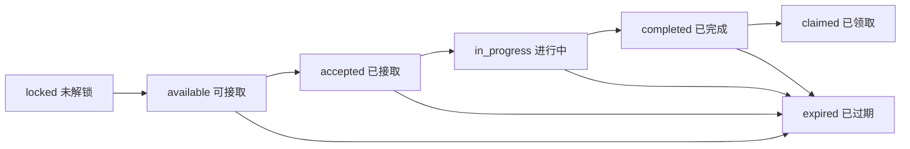

# 任务系统开发文档

最后更新：2026-06-29

## 1. 系统定位

任务系统是 Hero3 的通用成长反馈模块，负责通过配置化任务监听玩家行为事件，推进任务进度，并在玩家达成条件后发放奖励。

任务系统本质是：

```text
业务事件监听 -> 条件匹配 -> 进度记录 -> 完成判定 -> 奖励领取
```

任务系统不直接修改玩家长期资产，不直接发资源、发物品、扣兵、改建筑或改武将。所有奖励必须通过核心奖励服务、Effect Pipeline、物品系统和流水系统完成。

## 2. 设计目标

任务系统第一版按最终标准底座设计，任务内容由 GM 配置，不在代码中硬编码。

目标能力：

- 支持主线任务、每日任务、周常任务、成就任务、活动任务。
- 支持 GM 配置任务类型、条件、奖励、前置关系、开放时间和排序。
- 支持监听标准业务事件推进任务进度。
- 支持玩家领取奖励。
- 支持任务进度流水和奖励幂等。
- 支持 Admin 查看、编辑、启停任务配置。
- 支持 Admin 查看和修复玩家任务状态。
- 支持后续接入 PVP、副本、增援、轮回绝境、公告活动、物品使用等模块。

## 3. 模块边界

### 3.1 任务系统负责

- 读取任务配置。
- 初始化玩家任务状态。
- 订阅核心业务事件。
- 判断任务条件是否达成。
- 更新玩家任务进度。
- 维护任务状态流转。
- 提供任务列表和领取奖励接口。
- 调用奖励服务发放任务奖励。
- 记录任务进度流水。
- 提供 GM 任务配置和玩家任务修复能力。

### 3.2 任务系统不负责

- 不直接改资源。
- 不直接改物品背包。
- 不直接改兵力。
- 不直接改建筑等级。
- 不直接改武将经验。
- 不直接处理邮件补偿。
- 不直接实现 PVP、副本、增援等具体玩法规则。
- 不监听数据库表变更。

任务系统只监听标准业务事件，不通过扫描数据库变化推进任务。

## 4. 任务类型

### 4.1 主线任务

主线任务用于引导玩家成长，通常存在前后置关系。

特点：

- 长期存在。
- 通常按顺序解锁。
- 可以自动接取。
- 适合建筑、征兵、战斗、武将、资源等成长目标。

### 4.2 支线任务

支线任务用于补充玩法目标。

特点：

- 可以无强制顺序。
- 可以按系统分类展示。
- 可以长期存在或限时存在。

### 4.3 每日任务

每日任务用于每日活跃。

特点：

- 每日刷新。
- 使用 `cycle_key` 区分日期。
- 可配置活跃度，但第一版活跃度宝箱可预留。
- 到期未领取可按配置处理，默认不补发。

### 4.4 周常任务

周常任务用于中周期活跃。

特点：

- 每周刷新。
- 使用 `cycle_key` 区分自然周或配置周。
- 奖励高于每日任务。

### 4.5 成就任务

成就任务用于永久累计目标。

特点：

- 不周期刷新。
- 记录长期累计进度。
- 可以分阶段配置，例如击败 10、100、1000 次敌人。

### 4.6 活动任务

活动任务用于限时活动。

特点：

- 必须配置开始时间和结束时间。
- 可以绑定活动 ID。
- 可以监听活动、副本、战斗、物品等事件。
- 结束后不可继续推进，是否允许领取已完成奖励由配置决定。

## 5. 任务状态

玩家任务状态统一使用以下枚举：

```text
locked       未解锁
available    可接取
accepted     已接取
in_progress  进行中
completed    已完成未领取
claimed      已领取
expired      已过期
```

状态流转：



主线任务可以配置为自动接取，自动从 `available` 进入 `in_progress`。

每日、周常、活动任务需要根据周期和开放时间判断是否过期。

## 6. 任务配置模型

任务配置表保存 GM 配置结果。第一版可以存数据库，也可以从配置文件导入，但 Admin 最终必须以数据库配置为准。

建议结构：

```json
{
  "taskId": "main_001",
  "type": "main",
  "category": "building",
  "title": "升级主城",
  "description": "将主城升到 2 级",
  "icon": "building_main_city",
  "conditions": [
    {
      "conditionId": "c1",
      "eventType": "building_level_up",
      "mode": "reach",
      "targetType": "building",
      "targetId": "main_city",
      "field": "level",
      "operator": ">=",
      "targetValue": 2
    }
  ],
  "conditionRelation": "AND",
  "rewards": [
    {
      "type": "item",
      "itemId": "resource_pack_small",
      "amount": 1
    }
  ],
  "preTaskIds": [],
  "nextTaskIds": ["main_002"],
  "autoAccept": true,
  "autoComplete": true,
  "claimRequired": true,
  "sortOrder": 100,
  "enabled": true,
  "startAt": null,
  "endAt": null
}
```

## 7. 条件系统

### 7.1 条件关系

第一版必须支持：

- `AND`：所有条件完成才完成任务。

最终版预留：

- `OR`：任意条件完成即可完成任务。
- `GROUP`：条件分组。

第一版可以先实现 `AND`，但数据结构必须保留 `conditionRelation`。

### 7.2 条件模式

任务条件统一支持以下模式：

| 模式 | 含义 | 示例 |
| --- | --- | --- |
| `count` | 计数 | 完成 3 次战斗 |
| `accumulate` | 累计数值 | 累计训练 10000 士兵 |
| `reach` | 达到目标值 | 主城等级达到 10 |
| `own` | 拥有数量 | 拥有 100 万粮食 |
| `clear` | 通关目标 | 通关轮回绝境 3 级 |
| `win` | 胜利目标 | 击败玩家 5 次 |
| `use` | 使用目标 | 使用 3 个经验卡 |
| `obtain` | 获得目标 | 获得某类物品 10 个 |

### 7.3 条件匹配

条件匹配由以下字段共同决定：

- `eventType`：监听的事件类型。
- `targetType`：目标类型，例如 building、troop、battle、dungeon、item。
- `targetId`：具体目标 ID，可为空表示任意。
- `field`：读取事件 payload 中的字段。
- `operator`：比较方式。
- `targetValue`：目标值。
- `filters`：额外过滤条件。

示例：

```json
{
  "eventType": "troop_train_complete",
  "mode": "accumulate",
  "targetType": "troop",
  "targetId": "cavalry",
  "field": "amount",
  "operator": ">=",
  "targetValue": 10000
}
```

## 8. 标准业务事件

任务系统必须监听业务事件，而不是直接扫描数据库。

事件标准结构：

```json
{
  "eventId": "evt_20260629_000001",
  "eventType": "troop_train_complete",
  "playerId": 10001,
  "cityId": 20001,
  "payload": {
    "troopType": "cavalry",
    "amount": 1000,
    "foodCost": 2
  },
  "refType": "train_order",
  "refId": "order_001",
  "occurredAt": "2026-06-29T12:00:00+08:00"
}
```

第一版建议支持以下事件：

| 事件类型 | 来源系统 | 用途 |
| --- | --- | --- |
| `player_login` | 账号/玩家 | 登录任务 |
| `building_level_up` | 建筑 | 建筑升级任务 |
| `resource_collect` | 资源 | 资源采集任务 |
| `troop_train_complete` | 兵营 | 征兵任务 |
| `battle_finished` | 战斗 | NPC、玩家、掠夺、侦查相关任务 |
| `item_obtained` | 物品 | 获得物品任务 |
| `item_used` | 物品 | 使用物品任务 |
| `general_level_up` | 武将 | 武将成长任务 |
| `dungeon_wave_clear` | 副本 | 副本波次任务 |
| `dungeon_clear` | 副本 | 副本通关任务 |
| `reinforcement_sent` | 增援 | 派出增援任务 |
| `reinforcement_recalled` | 增援 | 召回增援任务 |

后续新增模块只需要注册新的事件类型和 payload 字段，不应修改任务系统主流程。

## 9. 进度记录

玩家任务进度使用 JSON 保存每个条件的进度。

示例：

```json
{
  "conditions": {
    "c1": {
      "current": 800,
      "target": 1000,
      "completed": false,
      "updatedAt": "2026-06-29T12:00:00+08:00"
    }
  }
}
```

要求：

- 每个条件必须有独立进度。
- 多条件任务必须逐项记录。
- 进度更新必须幂等。
- 同一个 `eventId` 不得重复推进进度。
- `reach` 和 `own` 类型需要允许重新读取当前值校验。
- `accumulate` 和 `count` 类型按事件增量累计。

## 10. 奖励发放

任务奖励必须调用核心奖励服务，不允许任务系统直接修改玩家资产。

奖励类型统一使用项目奖励结构：

```json
[
  {
    "type": "item",
    "itemId": "general_exp_small",
    "amount": 1
  },
  {
    "type": "resource",
    "resourceType": "food",
    "amount": 10000
  }
]
```

领取流程：

1. 玩家请求领取任务奖励。
2. 校验任务属于该玩家。
3. 校验任务状态为 `completed`。
4. 校验奖励未领取。
5. 开启事务。
6. 调用 Reward / Effect Pipeline 发奖。
7. 写奖励流水、物品流水、资源流水。
8. 更新任务状态为 `claimed`。
9. 提交事务。

幂等要求：

- 同一玩家同一任务同一周期只能领取一次。
- 重复点击领取不能重复发奖。
- 奖励发放失败时任务状态不能变成已领取。
- 任务状态已领取时再次领取应返回已领取，不应再次发奖。

## 11. 数据库设计

### 11.1 task_configs

任务配置表。

```sql
CREATE TABLE task_configs (
  id BIGINT PRIMARY KEY AUTO_INCREMENT,
  task_id VARCHAR(128) NOT NULL UNIQUE,
  type VARCHAR(32) NOT NULL,
  category VARCHAR(64) NOT NULL,
  title VARCHAR(128) NOT NULL,
  description VARCHAR(512) NOT NULL,
  icon VARCHAR(128) DEFAULT NULL,
  conditions_json JSON NOT NULL,
  condition_relation VARCHAR(16) NOT NULL DEFAULT 'AND',
  rewards_json JSON NOT NULL,
  pre_task_ids_json JSON DEFAULT NULL,
  next_task_ids_json JSON DEFAULT NULL,
  auto_accept TINYINT(1) NOT NULL DEFAULT 0,
  auto_complete TINYINT(1) NOT NULL DEFAULT 1,
  claim_required TINYINT(1) NOT NULL DEFAULT 1,
  sort_order INT NOT NULL DEFAULT 0,
  enabled TINYINT(1) NOT NULL DEFAULT 1,
  start_at DATETIME DEFAULT NULL,
  end_at DATETIME DEFAULT NULL,
  created_at DATETIME NOT NULL,
  updated_at DATETIME NOT NULL
);
```

### 11.2 player_tasks

玩家任务状态表。

```sql
CREATE TABLE player_tasks (
  id BIGINT PRIMARY KEY AUTO_INCREMENT,
  player_id BIGINT NOT NULL,
  task_id VARCHAR(128) NOT NULL,
  type VARCHAR(32) NOT NULL,
  status VARCHAR(32) NOT NULL,
  progress_json JSON NOT NULL,
  cycle_key VARCHAR(64) DEFAULT '',
  accepted_at DATETIME DEFAULT NULL,
  completed_at DATETIME DEFAULT NULL,
  claimed_at DATETIME DEFAULT NULL,
  expired_at DATETIME DEFAULT NULL,
  created_at DATETIME NOT NULL,
  updated_at DATETIME NOT NULL,
  UNIQUE KEY uk_player_task_cycle (player_id, task_id, cycle_key),
  KEY idx_player_type_status (player_id, type, status),
  KEY idx_task_id (task_id)
);
```

### 11.3 task_progress_events

任务进度流水表。

```sql
CREATE TABLE task_progress_events (
  id BIGINT PRIMARY KEY AUTO_INCREMENT,
  player_id BIGINT NOT NULL,
  task_id VARCHAR(128) NOT NULL,
  cycle_key VARCHAR(64) DEFAULT '',
  event_id VARCHAR(128) NOT NULL,
  event_type VARCHAR(128) NOT NULL,
  before_progress_json JSON DEFAULT NULL,
  after_progress_json JSON DEFAULT NULL,
  ref_type VARCHAR(64) DEFAULT NULL,
  ref_id VARCHAR(128) DEFAULT NULL,
  created_at DATETIME NOT NULL,
  UNIQUE KEY uk_task_event (player_id, task_id, cycle_key, event_id),
  KEY idx_player_task (player_id, task_id),
  KEY idx_event_type (event_type)
);
```

### 11.4 task_reward_claims

任务奖励领取流水表。

```sql
CREATE TABLE task_reward_claims (
  id BIGINT PRIMARY KEY AUTO_INCREMENT,
  player_id BIGINT NOT NULL,
  task_id VARCHAR(128) NOT NULL,
  cycle_key VARCHAR(64) DEFAULT '',
  reward_json JSON NOT NULL,
  reward_ref_id VARCHAR(128) NOT NULL,
  status VARCHAR(32) NOT NULL,
  error_message VARCHAR(512) DEFAULT NULL,
  created_at DATETIME NOT NULL,
  updated_at DATETIME NOT NULL,
  UNIQUE KEY uk_task_claim (player_id, task_id, cycle_key),
  KEY idx_player_created (player_id, created_at)
);
```

## 12. 后端接口

### 12.1 玩家接口

```text
GET  /api/v1/tasks
GET  /api/v1/tasks/:taskId
POST /api/v1/tasks/:taskId/accept
POST /api/v1/tasks/:taskId/claim
POST /api/v1/tasks/claim-all
```

说明：

- `GET /tasks` 支持按 `type` 查询。
- 主线自动接取时，`accept` 可不用暴露给前端。
- `claim-all` 只领取当前可领取任务，失败任务不影响其他任务，但必须返回失败原因。

### 12.2 GM 接口

```text
GET    /api/v1/admin/tasks/configs
POST   /api/v1/admin/tasks/configs
PUT    /api/v1/admin/tasks/configs/:taskId
POST   /api/v1/admin/tasks/configs/:taskId/enable
POST   /api/v1/admin/tasks/configs/:taskId/disable
POST   /api/v1/admin/tasks/configs/validate
GET    /api/v1/admin/tasks/players/:playerId
PUT    /api/v1/admin/tasks/players/:playerId/:taskId
POST   /api/v1/admin/tasks/players/:playerId/:taskId/repair
POST   /api/v1/admin/tasks/players/:playerId/:taskId/reissue-reward
```

GM 修复和补发必须记录操作日志。当前项目如果暂时不做完整审计，也至少要记录任务奖励领取流水和修复备注。

## 13. Admin 页面

Admin 任务配置页面需要支持：

- 任务列表。
- 按任务类型筛选。
- 按启用状态筛选。
- 新增任务。
- 编辑任务。
- 复制任务。
- 启用/禁用任务。
- 配置任务条件。
- 配置任务奖励。
- 配置前置任务。
- 配置开放时间。
- 配置排序。
- 保存前校验。

Admin 玩家任务页面需要支持：

- 输入玩家 ID 查询任务状态。
- 查看主线、每日、周常、成就、活动任务进度。
- 查看条件级进度。
- 查看任务进度流水。
- 手动调整状态。
- 手动修复进度。
- 手动补发奖励。

## 14. 前端玩家页面

任务入口建议放在主界面常驻菜单中。

页面结构：

- 顶部 Tab：主线、每日、周常、成就、活动。
- 任务卡片：标题、描述、进度、奖励、状态按钮。
- 状态按钮：前往、领取、已领取、已过期。
- 每日任务显示刷新时间。
- 活动任务显示剩余时间。
- 成就任务显示累计完成进度。

任务卡片字段：

- 任务名称。
- 任务描述。
- 当前进度 / 目标进度。
- 奖励图标和数量。
- 任务状态。
- 前往按钮。

第一版可以不做复杂活跃度宝箱，但每日任务数据结构需要预留活跃度字段。

## 15. 配置校验

任务配置保存前必须校验：

- `taskId` 非空且唯一。
- `type` 必须是允许的任务类型。
- `category` 必须是允许分类。
- `title` 和 `description` 非空。
- `conditions` 至少一条。
- `conditionRelation` 必须合法。
- `eventType` 必须是已注册事件。
- `mode` 必须是已支持条件模式。
- `operator` 必须合法。
- `targetValue` 必须合法。
- `rewards` 至少一条。
- 奖励 itemId 必须存在。
- 奖励资源类型必须存在。
- 前置任务必须存在。
- 前置任务不能形成循环依赖。
- 每日和周常任务必须有周期策略。
- 活动任务必须配置 `startAt` 和 `endAt`。
- `endAt` 必须晚于 `startAt`。
- 禁止删除已经有玩家进度的任务配置，只允许禁用。

## 16. 周期刷新

每日、周常任务不应直接覆盖旧数据。

建议使用 `cycle_key`：

- 每日任务：`daily_2026-06-29`
- 周常任务：`weekly_2026-W27`
- 活动任务：`activity_{activityId}`

刷新逻辑：

1. 玩家打开任务页或登录时检查当前周期。
2. 若当前周期任务不存在，则初始化当前周期任务。
3. 旧周期未领取任务按配置处理。
4. 默认旧周期过期，不自动补发。

## 17. 和其他系统的关系

### 17.1 奖励系统

任务奖励必须走 Reward / Effect Pipeline。

### 17.2 物品系统

任务奖励中的物品只引用 `itemId`，不写物品内容。

### 17.3 事件管线

任务系统消费事件管线中的标准事件。

### 17.4 战斗系统

战斗系统只负责发出 `battle_finished` 事件。任务系统根据事件中的 battleType、sourceType、result 判断任务进度。

### 17.5 副本系统

副本系统发出 `dungeon_wave_clear`、`dungeon_clear` 等事件。任务系统不理解副本内部规则。

### 17.6 增援系统

增援系统发出派出、召回、参与防守等事件。任务系统只根据事件推进进度。

### 17.7 公告系统

公告系统只发布公告，不发任务奖励。活动公告可以引导玩家前往任务或活动页面。

## 18. 幂等与并发

必须保证：

- 同一个事件不会重复推进同一个任务。
- 同一个任务奖励不会重复领取。
- 并发领取时只能成功一次。
- 任务进度更新和完成状态更新必须在事务内完成。
- 奖励发放和领取状态更新必须在事务内完成。
- GM 修复不能破坏奖励领取幂等。

推荐锁策略：

- 进度更新时锁定对应 `player_tasks` 行。
- 领取奖励时锁定对应 `player_tasks` 行和 `task_reward_claims` 唯一键。
- 事件流水使用唯一键防重复。

## 19. 日志与排查

任务系统必须保留以下排查信息：

- 玩家任务状态。
- 条件级进度。
- 进度变更流水。
- 事件 ID。
- 奖励领取流水。
- 奖励发放引用 ID。
- GM 修复备注。

常见问题需要能排查：

- 玩家做了行为但任务没加进度。
- 玩家任务完成但不能领取。
- 玩家重复点击领取。
- GM 修改任务配置后旧玩家进度如何处理。
- 活动任务过期后是否还能领取。

## 20. 第一版开发范围

第一版按完整底座开发，具体任务内容由 GM 配置。

必须完成：

- 任务配置表。
- 玩家任务进度表。
- 任务进度流水表。
- 任务奖励领取流水表。
- 任务配置校验。
- 标准事件消费器。
- 主线任务支持。
- 每日任务支持。
- 周常任务支持。
- 成就任务支持。
- 活动任务支持。
- 玩家任务列表接口。
- 玩家领取奖励接口。
- Admin 任务配置页面。
- Admin 玩家任务查看和修复页面。
- OpenAPI 文档。
- 基础单元测试和接口测试。

第一版暂不做：

- 通行证。
- 公会任务。
- 跨服任务。
- 任务排行榜。
- 付费解锁任务线。
- 自动扫荡任务。
- 复杂条件分组编辑器。

以上功能数据结构预留，但不进入第一版实现。

## 21. 验收标准

后端验收：

- GM 可以新增、编辑、启用、禁用任务。
- GM 保存任务时会执行配置校验。
- 玩家打开任务页可以看到当前可见任务。
- 玩家行为事件可以正确推进任务进度。
- 多条件任务可以正确完成。
- 主线任务可以按前置关系解锁。
- 每日任务按日期刷新。
- 周常任务按周期刷新。
- 活动任务按开放时间生效和过期。
- 完成任务后可以领取奖励。
- 重复领取不会重复发奖。
- 任务奖励发放走 Reward / Effect Pipeline。
- 物品奖励写入物品流水。
- 进度变更写入任务进度流水。
- GM 可以查看玩家任务进度。
- GM 可以修复玩家任务状态。

前端验收：

- 玩家任务页按类型 Tab 展示。
- 任务进度显示准确。
- 奖励显示准确。
- 可领取任务有明显状态。
- 已领取任务不可重复领取。
- 过期任务状态清晰。
- 每日和活动任务显示剩余时间或刷新时间。
- Admin 任务配置页面可以完成完整配置流程。

安全验收：

- 普通玩家不能访问 GM 任务接口。
- 玩家不能领取别人的任务奖励。
- 玩家不能领取未完成任务奖励。
- 玩家不能通过重复请求刷奖励。
- 禁用任务后新玩家不可见，旧玩家状态按配置处理。

## 22. 推荐开发顺序

1. 建表和数据模型。
2. 任务配置读取与校验。
3. 玩家任务初始化。
4. 事件消费和条件匹配。
5. 进度更新和完成判定。
6. 奖励领取和幂等。
7. 玩家任务接口。
8. Admin 配置接口。
9. Admin 玩家任务修复接口。
10. 前端玩家任务页。
11. Admin 任务配置页。
12. OpenAPI 和测试补齐。

## 23. 最终结论

Hero3 的任务系统应按“配置化任务 + 标准业务事件 + 条件匹配 + 核心奖励发放”的方式实现。

这种设计符合游戏行业常见做法，也符合 Hero3 当前模块化单体架构。后续新增玩法不需要重写任务系统，只需要新增事件类型、payload 字段和 GM 任务配置。
